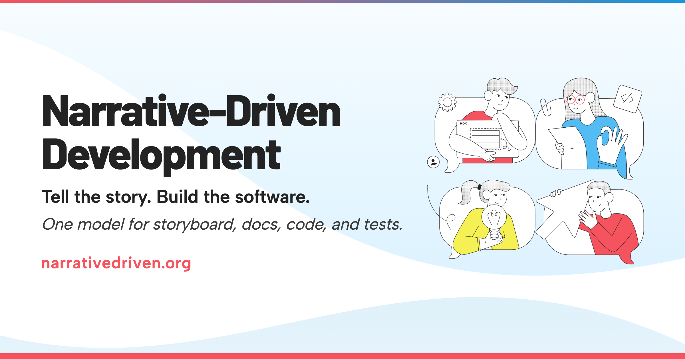

<p align="center">
  <a href="https://narrativedriven.org">
    
  </a>
</p>

<h3 align="center">Tell the story. Build the software.</h3>

<p align="center">
  <a href="https://narrativedriven.org"><strong>narrativedriven.org</strong></a> ·
  <a href="https://narrativedriven.org/what-is-ndd">What is NDD?</a> ·
  <a href="https://narrativedriven.org/guides/">Guides</a> ·
  <a href="https://narrativedriven.org/reference/">Reference</a> ·
  <a href="https://discord.com/invite/B8BKcKMRm8">Discord</a>
</p>

---

[narrativedriven.org](https://narrativedriven.org) explains Narrative-Driven Development: specify software as narratives that serve as a single model for storyboard, docs, code, and tests. The site covers [what NDD is](https://narrativedriven.org/what-is-ndd), how to [write your first narrative](https://narrativedriven.org/guides/first-narrative), and the [thinking behind it](https://narrativedriven.org/explanation/).

This repo is the source for the site. Go read it, then come back here to help make it better.

## Contribute

Every page on the site has an **Edit this page on GitHub** link at the bottom.

- **Fix something**: See a typo, an unclear sentence, a broken link? Open a PR.
- **Disagree with something?** Open an issue or bring it to [Discord](https://discord.com/invite/B8BKcKMRm8).
- **Join the conversation**: [Discord](https://discord.com/invite/B8BKcKMRm8) is where the community gathers.

## Run locally

```bash
npm install
npm run dev
```

## License

[CC BY-NC-ND 4.0](./LICENSE) · An initiative by [Auto](https://on.auto).
