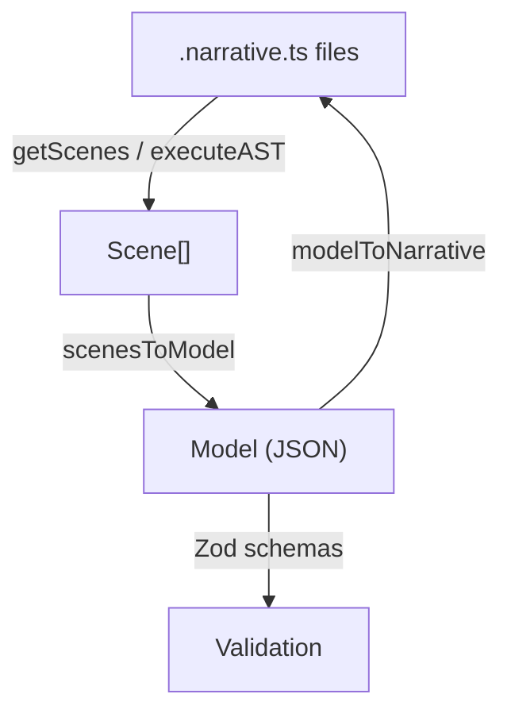

# @onauto/narrative — Fluent TypeScript DSL for defining behavioral specifications as scenes, moments, and examples

## Purpose

Without `@onauto/narrative`, you would have to hand-write JSON model files describing your system's scenes, moments, messages, data flows, and BDD specifications — then manually keep them in sync with your TypeScript types. This package provides a fluent DSL that lets you author `.narrative.ts` files, automatically extracts type information from your code, and bidirectionally transforms between the DSL representation and a canonical JSON model.

## Key Concepts

- **Scene** — A top-level container grouping related moments (e.g., "Place order"). Defined with the `scene()` function.
- **Moment** — A single interaction point within a scene. Four types exist: `command` (user-triggered state changes), `query` (data reads), `react` (automated responses to events), and `experience` (client-only UI behavior).
- **Spec / Rule / Example** — BDD-style specifications nested inside moments. A spec contains rules; a rule contains examples; an example contains Given/When/Then steps.
- **Data flow** — `sink`, `source`, and `target` builders describe how messages route between streams, projections, databases, integrations, and topics.
- **Model** — The canonical JSON representation (`Model` type) holding scenes, messages, integrations, modules, and narratives. Validated by Zod schemas.
- **Integration** — An external service (e.g., MailChimp, Twilio) wrapped with `createIntegration()` and referenced via the `via()` builder method.



## Installation

```bash
pnpm add @onauto/narrative
```

## Quick Start

```typescript
import {
  scene,
  command,
  specs,
  rule,
  example,
  data,
  sink,
  source,
  describe,
  it,
  defineCommand,
  defineEvent,
} from '@onauto/narrative';

// Declare domain types as runtime-tagged values via factories. The factories
// register each (name → classification) pair and carry the data shape for
// TypeScript inference on the step data argument.
const PlaceOrder = defineCommand<{ productId: string; quantity: number }>('PlaceOrder');
const OrderPlaced = defineEvent<{ orderId: string; productId: string; quantity: number }>('OrderPlaced');

scene('Place order', () => {
  command('Submit order')
    .stream('order-${orderId}')
    .client(() => {
      describe('Order submission form', () => {
        it('allows product selection');
        it('allows quantity input');
      });
    })
    .server(() => {
      data([
        sink().event('OrderPlaced').toStream('order-${orderId}'),
        source().state('OrderSummary').fromProjection('OrderSummary', 'orderId'),
      ]);

      specs('User submits a new order', () => {
        rule('Valid orders should be processed', () => {
          example('User places order for available product')
            .when(PlaceOrder, 'the user places an order', { productId: 'product_789', quantity: 3 })
            .then(OrderPlaced, 'the order is placed', {
              orderId: 'order_001',
              productId: 'product_789',
              quantity: 3,
            });
        });
      });
    });
});
```

## How-to Guides

### Define a query moment

```typescript
import { scene, query, specs, rule, example, data, source } from '@onauto/narrative';

scene('View orders', () => {
  query('Get order summary')
    .client(() => {
      describe('Order list', () => {
        it('displays order details');
      });
    })
    .server(() => {
      data([
        source().state('OrderSummary').fromProjection('OrderSummary', 'orderId'),
      ]);

      specs('Fetching order data', () => {
        rule('Returns matching orders', () => {
          example('Order exists')
            .given(OrderSummary, 'an existing order summary', { orderId: 'order_001', productId: 'p1', quantity: 2 })
            .when(GetOrderSummary, 'the caller requests the summary', { orderId: 'order_001' })
            .then(OrderSummary, 'the summary is returned', { orderId: 'order_001', productId: 'p1', quantity: 2 });
        });
      });
    });
});
```

### Define a reaction moment

```typescript
import { scene, react, specs, rule, example, createIntegration } from '@onauto/narrative';

const emailService = createIntegration('email', 'EmailService');

scene('Order confirmation', () => {
  react('Send confirmation email')
    .via(emailService)
    .server(() => {
      specs('Email sent on order placement', () => {
        rule('Confirmation email is sent', () => {
          example('Order placed triggers email')
            .given(OrderPlaced, 'an order has been placed', { orderId: 'order_001', productId: 'p1', quantity: 2 })
            .then(ConfirmationEmailSent, 'a confirmation email is sent', { orderId: 'order_001' });
        });
      });
    });
});
```

### Define data sinks and sources

```typescript
import { data, sink, source, target } from '@onauto/narrative';

// Event to stream
sink().event('OrderPlaced').toStream('order-${orderId}');

// Event to integration
sink().event('OrderPlaced').toIntegration(emailService);

// Event to database
sink().event('OrderPlaced').toDatabase('orders');

// Command to integration with message routing
sink().command('SendEmail').toIntegration(emailService, 'SendEmail', 'command');

// State from projection
source().state('OrderSummary').fromProjection('OrderSummary', 'orderId');

// State from singleton projection
source().state('DashboardStats').fromSingletonProjection('DashboardStats');

// State from API
source().state('ExternalData').fromApi('/api/data', 'GET');

// Event target (declaration only, no routing)
target().event('OrderPlaced');
```

### Load narrative files and produce a model

```typescript
import { getScenes } from '@onauto/narrative';

const result = await getScenes({
  vfs,   // IFileStore instance
  root: '/path/to/narratives',
});

console.log(result.scenes);        // Scene[]
const model = result.toModel();    // Model (full JSON specification)
```

### Convert a model back to narrative files

```typescript
import { modelToNarrative } from '@onauto/narrative';

const generated = await modelToNarrative(model);
for (const file of generated.files) {
  console.log(file.path, file.code);
}
```

### Add auto-generated IDs to a model

```typescript
import { addAutoIds, hasAllIds } from '@onauto/narrative';

if (!hasAllIds(model)) {
  const withIds = addAutoIds(model);
}
```

### Validate moment requests against the model

```typescript
import { validateMomentRequests } from '@onauto/narrative';

const errors = validateMomentRequests(model);
if (errors.length > 0) {
  errors.forEach((e) => console.error(`${e.sceneName}/${e.momentName}: ${e.message}`));
}
```

## API Reference

### Subpath exports

| Import path | Description |
|---|---|
| `@onauto/narrative` | Main entry — DSL functions, builders, transformers, and all schema re-exports |
| `@onauto/narrative/schema` | Zod schemas and inferred TypeScript types for the model |
| `@onauto/narrative/node` | Re-exports everything from the main entry (Node.js convenience alias) |

### Scene and moment DSL

```typescript
function scene(name: string, fn: () => void): void;
function scene(name: string, id: string, fn: () => void): void;

function command(name: string, id?: string): FluentCommandMomentBuilder;
function query(name: string, id?: string): FluentQueryMomentBuilder;
function react(name: string, id?: string): FluentReactionMomentBuilder;
function experience(name: string, id?: string): FluentExperienceMomentBuilder;

// Aliases
function decide(name: string, id?: string): FluentCommandMomentBuilder;
function evolve(name: string, id?: string): FluentQueryMomentBuilder;
```

### Fluent moment builders

```typescript
interface FluentCommandMomentBuilder {
  stream(name: string): FluentCommandMomentBuilder;
  client(fn: () => void): FluentCommandMomentBuilder;
  client(description: string, fn: () => void): FluentCommandMomentBuilder;
  server(fn: () => void): FluentCommandMomentBuilder;
  server(description: string, fn: () => void): FluentCommandMomentBuilder;
  via(integration: Integration | Integration[]): FluentCommandMomentBuilder;
  retries(count: number): FluentCommandMomentBuilder;
  request(mutation: unknown): FluentCommandMomentBuilder;
}

interface FluentQueryMomentBuilder {
  client(fn: () => void): FluentQueryMomentBuilder;
  client(description: string, fn: () => void): FluentQueryMomentBuilder;
  server(fn: () => void): FluentQueryMomentBuilder;
  server(description: string, fn: () => void): FluentQueryMomentBuilder;
  request(query: unknown): FluentQueryMomentBuilder;
}

interface FluentReactionMomentBuilder {
  server(fn: () => void): FluentReactionMomentBuilder;
  server(description: string, fn: () => void): FluentReactionMomentBuilder;
  via(integration: Integration | Integration[]): FluentReactionMomentBuilder;
  retries(count: number): FluentReactionMomentBuilder;
}

interface FluentExperienceMomentBuilder {
  client(fn: () => void): FluentExperienceMomentBuilder;
  client(description: string, fn: () => void): FluentExperienceMomentBuilder;
}
```

### Spec DSL

```typescript
function specs(feature: string, fn: () => void): void;
function specs(fn: () => void): void;
function rule(name: string, fn: () => void): void;
function rule(name: string, id: string, fn: () => void): void;
function example(name: string, id?: string): ExampleBuilder;
function thenError(errorType: 'IllegalStateError' | 'ValidationError' | 'NotFoundError', message?: string): void;

interface ExampleBuilder {
  given<T>(data: T): GivenBuilder;
  when<W>(data: W): WhenBuilder;
}

interface GivenBuilder {
  and<T>(data: T): GivenBuilder;
  when<W>(data: W): WhenBuilder;
  then<T>(data: T): ThenBuilder;
}

interface WhenBuilder {
  then<T>(data: T): ThenBuilder;
  and<T>(data: T): WhenBuilder;
}

interface ThenBuilder {
  and<T>(data: T): ThenBuilder;
}
```

### Client spec DSL

```typescript
function describe(title: string, fn: () => void): void;
function describe(title: string, id: string, fn: () => void): void;
function it(title: string, id?: string): void;
function should(title: string, id?: string): void;  // alias for it
```

### Data flow builders

```typescript
function sink(id?: string): DataSinkBuilder;
function source(id?: string): DataSourceBuilder;
function target(id?: string): DataTargetBuilder;
function data(config: Data | (DataItem | DataTargetItem)[]): void;

class DataSinkBuilder {
  event(name: string): EventSinkBuilder;
  command(name: string): CommandSinkBuilder;
  state(name: string): StateSinkBuilder;
}

class EventSinkBuilder {
  toStream(pattern: string): ChainableSink;
  toIntegration(...systems: Integration[]): ChainableSink;
  toDatabase(collection: string): ChainableSink;
  toTopic(name: string): ChainableSink;
}

class CommandSinkBuilder {
  withState(source: DataSourceItem): this;
  toIntegration(system: Integration | string, messageName: string, messageType: 'command' | 'query' | 'reaction'): ChainableSink;
  toDatabase(collection: string): ChainableSink;
  toTopic(name: string): ChainableSink;
  hints(hint: string): ChainableSink;
}

class StateSinkBuilder {
  toDatabase(collection: string): ChainableSink;
  toStream(pattern: string): ChainableSink;
}

class DataSourceBuilder {
  state<S>(name: string): StateSourceBuilder<S>;
}

class StateSourceBuilder<S> {
  fromProjection(name: string, idField: string): ChainableSource;
  fromSingletonProjection(name: string): ChainableSource;
  fromCompositeProjection(name: string, idFields: string[]): ChainableSource;
  fromReadModel(name: string): ChainableSource;
  fromDatabase(collection: string, query?: Record<string, unknown>): ChainableSource;
  fromApi(endpoint: string, method?: string): ChainableSource;
  fromIntegration(...systems: (Integration | string)[]): ChainableSource;
}

class DataTargetBuilder {
  event(name: string): DataTargetItem;
}
```

### Integration

```typescript
function createIntegration<T extends string>(type: T, name: string): Integration<T>;

interface Integration<Type extends string> {
  readonly type: Type;
  readonly name: string;
  readonly Queries?: Record<string, (...args: any[]) => Promise<any>>;
  readonly Commands?: Record<string, (...args: any[]) => Promise<any>>;
  readonly Reactions?: Record<string, (...args: any[]) => Promise<any>>;
}
```

### Scene loading and model conversion

```typescript
function getScenes(opts: GetScenesOptions): Promise<{
  scenes: Scene[];
  vfsFiles: string[];
  externals: string[];
  typings: Record<string, string[]>;
  typeMap: Map<string, string>;
  typesByFile: Map<string, Map<string, unknown>>;
  givenTypesByFile: Map<string, unknown[]>;
  toModel: () => Model;
}>;

interface GetScenesOptions {
  vfs: IFileStore;
  root: string;
  pattern?: RegExp;            // default: /\.(narrative|integration)\.(ts|tsx|js|jsx|mjs|cjs)$/
  importMap?: Record<string, unknown>;
  fastFsScan?: boolean;
}

function modelToNarrative(model: Model): Promise<GeneratedScenes>;

interface GeneratedScenes {
  files: Array<{ path: string; code: string }>;
}
```

### ID utilities

```typescript
function addAutoIds(model: Model): Model;
function hasAllIds(model: Model): boolean;
```

### GraphQL request parsing

```typescript
function parseGraphQlRequest(request: string): ParsedGraphQlOperation;
function parseMomentRequest(moment: { request?: string }): ParsedGraphQlOperation | undefined;

interface ParsedGraphQlOperation {
  operationName: string;
  args: ParsedArg[];
}

interface ParsedArg {
  name: string;
  tsType: string;
  graphqlType: string;
  nullable: boolean;
}
```

### Validation

```typescript
function validateMomentRequests(model: Model): MomentRequestValidationError[];

interface MomentRequestValidationError {
  type: string;
  message: string;
  sceneName: string;
  momentName: string;
}
```

### Declaring domain types

Domain types are declared as runtime-tagged values via factories. Each factory
call registers the type's classification in a module-load-time registry so the
downstream pipeline and validator can resolve it.

```typescript
import { defineCommand, defineEvent, defineState, defineQuery } from '@onauto/narrative';

const PlaceOrder = defineCommand<{ productId: string; quantity: number }>('PlaceOrder');
const OrderPlaced = defineEvent<{ orderId: string; productId: string; quantity: number }>('OrderPlaced');
const OrderSummary = defineState<{ orderId: string; productId: string; quantity: number }>('OrderSummary');
const GetOrders = defineQuery<{ customerId: string }>('GetOrders');
```

The generic type argument is the data shape (what the docString in each step
must match); the string argument is the runtime type name. Each factory returns
a `TypedRef<kind, name, data>` object you pass as the first positional arg to
`.given` / `.when` / `.then` / `.and`.

The legacy `Command<T,D>` / `Event<T,D>` / `State<T,D>` / `Query<T,D>` type
aliases are still exported for external consumers that encoded messages as
type aliases, but internal DSL code uses the factories.

### Key Zod schemas (`@onauto/narrative/schema`)

| Schema | Validates |
|---|---|
| `modelSchema` | Complete `Model` with scenes, messages, modules, narratives |
| `SceneSchema` | A scene with moments |
| `MomentSchema` | Discriminated union of command/query/react/experience moments |
| `CommandMomentSchema` | Command moment with client/server blocks |
| `QueryMomentSchema` | Query moment with client/server blocks |
| `ReactMomentSchema` | Reaction moment with server block |
| `ExperienceMomentSchema` | Experience moment with client block |
| `MessageSchema` | Discriminated union of command/event/state/query messages |
| `SpecSchema` | Gherkin specification with rules and examples |
| `DataSchema` | Data configuration with sinks, sources, and targets |
| `NarrativeSchema` | Narrative grouping scenes into an ordered flow |
| `ModuleSchema` | Module for type ownership and file grouping |
| `DesignSchema` | Design fields for visual representation (image assets, UI specs) |
| `UISpecSchema` | Flat element-map UI specification |
| `NarrativePlanningSchema` | Progressive disclosure variant for planning |
| `SceneNamesSchema` | Scene names only (initial ideation) |
| `MomentNamesSchema` | Scene + moment names (structure planning) |
| `ClientServerNamesSchema` | Scene + moment + client/server descriptions |

## Architecture

### File tree

```
src/
  index.ts                          Main entry, re-exports all public API
  schema.ts                         Zod schemas and inferred types for the model
  node.ts                           Node.js convenience re-export
  narrative.ts                      Core DSL: scene, specs, rule, example, data
  fluent-builder.ts                 Fluent moment builders: command, query, react, experience
  narrative-context.ts              Mutable execution context tracking current scene/moment/spec
  narrative-registry.ts             Global singleton registry collecting scenes
  data-narrative-builders.ts        sink/source/target builder chains
  types.ts                          TypeScript types: Command, Event, State, Query, Integration
  getScenes.ts                      File discovery, compilation, caching, and model assembly
  parse-graphql-request.ts          GraphQL request string parser
  validate-slice-requests.ts        Model-level request validation
  testing.ts                        Legacy testing helpers (deprecated)
  ts-type-helpers.ts                Inline object type parsing utilities
  slice-builder.ts                  Alternative moment builder (MomentBuilder pattern)
  id/
    addAutoIds.ts                   Assigns auto-generated IDs to all model nodes
    hasAllIds.ts                    Checks whether every node has an ID
    generators.ts                   ID generation functions
  loader/
    index.ts                        executeAST: TS compilation + CJS execution pipeline
    graph.ts                        Dependency graph builder
    resolver.ts                     Module resolution
    runtime-cjs.ts                  CJS runtime for executing compiled modules
    importmap.ts                    Import map creation with built-in shims
    ts-utils.ts                     TypeScript AST utilities for type extraction
    vfs-compiler-host.ts            Virtual filesystem compiler host
  transformers/
    narrative-to-model/
      index.ts                      scenesToModel: Scene[] -> Model
      assemble.ts                   Final model assembly (modules, narratives)
      spec-processors.ts            Given/When/Then step processing
      type-inference.ts             Type resolution from AST info
      derive-modules.ts             Auto-derive module structure from source files
      inlining.ts                   Inline type references in message fields
      integrations.ts               Extract integration metadata from data items
    model-to-narrative/
      index.ts                      modelToNarrative: Model -> .narrative.ts files
      generators/                   Code generators for imports, types, GWT, flows
      formatting/                   Prettier formatting and type sorting
```

### Dependency table

| Dependency | Role |
|---|---|
| `@auto-engineer/file-store` | Virtual filesystem abstraction for reading narrative files |
| `@auto-engineer/id` | ID generation utilities |
| `@auto-engineer/message-bus` | Message bus integration |
| `zod` | Schema definition and runtime validation |
| `zod-to-json-schema` | Convert Zod schemas to JSON Schema |
| `typescript` | TypeScript compiler API for AST analysis and type extraction |
| `graphql` / `graphql-tag` | GraphQL parsing for request definitions |
| `prettier` | Code formatting for generated narrative files |
| `js-sha256` | Content hashing for compilation caching |
| `fast-glob` | File discovery |
| `debug` | Debug logging (`auto:narrative:*` namespace) |
